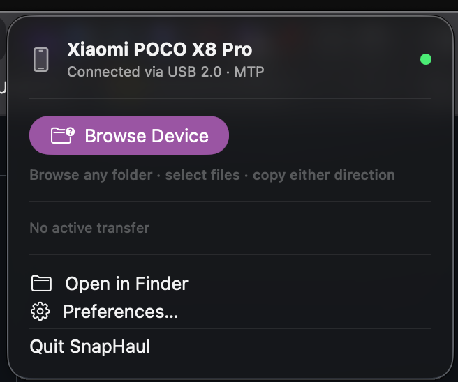

<p align="center">
  
</p>

<h1 align="center">SnapHaul</h1>

<p align="center">
  <strong>One cable. One click. Every file.</strong><br>
  The reliable way to move files between Android and Mac.
</p>

<p align="center">
  <a href="#why-this-exists">Why</a> •
  <a href="#what-it-does">What</a> •
  <a href="#features">Features</a> •
  <a href="#performance">Performance</a> •
  <a href="#installation">Install</a> •
  <a href="#architecture">Architecture</a> •
  <a href="#roadmap">Roadmap</a>
</p>

<p align="center">
  
  
  
  
  
</p>

---

## Why This Exists

macOS has **no native MTP support**. Plug in an Android phone and Finder shows nothing.

Google killed Android File Transfer. The alternatives are worse:

| Tool | Problem |
|:-----|:--------|
| **OpenMTP** | Electron app. Custom MTP kernel (Go) but still wraps it in Chromium. No ingest automation, no delta-sync, no Finder integration. Reports of breakage on M4 + Sequoia. |
| **MacDroid** | Requires macFUSE kernel extension. Apple blocks kexts on Apple Silicon by default. Paid subscription. |
| **Commander One** | macFUSE dependency. General-purpose file manager, not built for media workflows. |
| **ShotPut Pro** | $169. No Android support. Camera cards only. |
| **Cloud sync** | Uploads 50 GB to Google's servers to move files 30 cm. |

**Millions of Android + Mac users** have no reliable, native way to move files between their phone and their computer.

SnapHaul fixes this. Native Swift app, custom MTP protocol stack, zero kernel extensions, zero network calls. Plug in, pull files, done.

---

## What It Does


Three ways to work:

**Finder volume** — Your Android device appears in the Finder sidebar like iCloud Drive. Drag files in and out. Quick Look. Open in any app. Standard Finder operations.

**File browser** — Full file manager with sidebar navigation, thumbnails, multi-select, drag-and-drop, bidirectional copy, Quick Look preview.

**Automated ingest** — Define a profile once. Next time you plug in, it runs automatically: only new files, checksummed, renamed by EXIF data, organized into date folders, copied to backup drives, PDF report generated.

---

## Features

### Transfer Engines

| Engine | Setup | Speed | Best For |
|:-------|:------|:------|:---------|
| **MTP** (custom CMTPCore stack) | None — just set phone to "File Transfer" | 30–80 MB/s | Everyone. No developer setup needed. |
| **ADB** (4 parallel streams) | Enable USB Debugging once | 80–150 MB/s | Power users, large batches, unreliable MTP devices |
| **Wi-Fi** (ADB over TCP/IP) | One-time USB pairing | 20–80 MB/s | Cable-free convenience |

Engine selection is automatic. Falls back gracefully.

The MTP engine is **not a wrapper around libmtp**. It's a custom, pure C protocol stack (CMTPCore) with libusb for USB I/O — similar in ambition to OpenMTP's "Kalam Kernel" (Go-based), but implemented in C for zero-overhead Apple Silicon performance, with per-vendor quirk handling for Samsung, Xiaomi, OnePlus, and others. No Electron. No Go runtime. No Chromium process tree.

### Professional Ingest Pipeline

```
Device → Discover → Filter → Delta-Sync → Transfer → Verify → Organize → Report
```

| Feature | What it does |
|:--------|:-------------|
| **Delta-sync** | SQLite manifest tracks what's already transferred. Never re-copies files. |
| **Checksum verification** | XXH3 (30 GB/s on Apple Silicon) or SHA-256 (forensic-grade). Every file verified. |
| **EXIF-aware naming** | `{date}_{camera}_{sequence}.{ext}` → `20260503_S25Ultra_0001.dng` |
| **Sidecar pairing** | RAW+XMP, ARW+JPG stay together through renaming |
| **Multi-destination copy** | Primary SSD + backup drives simultaneously. Per-destination verification. |
| **Smart queue** | Largest first, newest first, or custom priority per profile |
| **Post-ingest hooks** | Shell scripts with env vars + JSON report on stdin. Trigger Lightroom, DaVinci Resolve, NAS rsync, Slack. |
| **Transfer reports** | PDF (client-ready with checksums), CSV, JSON. Auto-generated after every session. |
| **Auto-trigger** | Starts when your device connects. Zero clicks. |

This is what ShotPut Pro charges $169 for. SnapHaul does it free.

### File Management

- Browse any folder on the device
- Table view with sort by name/size/date/type
- Thumbnail previews (real images, not generic icons)
- Multi-select, drag-and-drop (both directions — Android ↔ Mac)
- Spacebar Quick Look preview
- Sidebar with DCIM, Downloads, Pictures, Movies, Music, Documents
- Copy, delete, rename files on device
- Breadcrumb path bar, back button, double-click navigation

### macOS Integration

- **Finder volume** — device appears in sidebar via File Provider (no kexts)
- **Menu bar** — device status, one-click ingest, live transfer progress
- **Notifications** — connect/disconnect, ingest complete, errors, checksum failures
- **Power-aware** — auto-detects battery vs AC. Fewer streams, deferred checksums, E-core routing on battery.
- **Security-Scoped Bookmarks** — persistent destination access without re-prompting
- **Hardened Runtime + Notarization** — installs without disabling Gatekeeper

### 90+ File Types

RAW (DNG, ARW, CR3, CR2, NEF, RAF, RW2, ORF), Video (MP4, MOV, MKV, ProRes, RED R3D, BRAW), Audio (MP3, FLAC, WAV, AAC), Images (JPEG, PNG, HEIC, WebP, AVIF), Documents (PDF, Office), and everything else.

---

## Performance

Not a wrapper. Engineered from the ground up for Apple Silicon.

| Technique | Why |
|:----------|:----|
| Custom MTP stack (CMTPCore) | No libmtp overhead. Pipelined requests. Vendor-specific quirk handling. |
| `F_NOCACHE` direct I/O | Write-once transfer data doesn't pollute the 8 GB buffer cache |
| `mmap(PROT_READ)` checksumming | Zero-copy verification — no read buffer allocation |
| Page-aligned buffers (16 KB) | Optimal DMA on Apple Silicon |
| `F_PREALLOCATE` contiguous allocation | No disk fragmentation on destination |
| Adaptive chunk sizing | Calibrates to measured USB throughput per session |
| 4 parallel ADB streams | Saturates USB 3.x bandwidth (2 on battery) |
| SQLite WAL + mmap | Sub-millisecond manifest lookups for delta-sync |
| `F_FULLFSYNC` | Data confirmed on disk, not just in OS buffer |
| Deferred Spotlight indexing | Suppressed during transfer, batched after |

### Targets

| Scenario | Target |
|:---------|:-------|
| Single large file (MTP, USB 3.x) | ≥ 60 MB/s sustained |
| Single large file (ADB, USB 3.x) | ≥ 120 MB/s sustained |
| 1,000 small files (MTP) | ≥ 30 MB/s aggregate |
| 1,000 small files (ADB) | ≥ 80 MB/s aggregate |
| Delta-sync re-scan (10K files, 90% synced) | < 30 seconds |
| Memory (idle) | < 80 MB |
| Memory (active, 4 streams) | < 250 MB |
| App launch to menu bar ready | < 1 second |

---

## Supported Devices

| Tier | Devices | Support |
|:-----|:--------|:--------|
| **Tier 1** | Samsung Galaxy S24/S25, Google Pixel 8/9, Sony Xperia 1 V/VI | Full MTP + ADB + Wi-Fi. Tested. |
| **Tier 2** | OnePlus, Xiaomi, Nothing, Motorola | MTP + ADB. Community-tested. |
| **Tier 3** | Any Android 10+ with MTP | MTP should work. |

OEM quirks (Samsung large file sizes, Xiaomi connection drops, OnePlus session timeouts) handled automatically via `DeviceQuirks`.

### Requirements

| | Minimum | Recommended |
|:--|:--------|:------------|
| **macOS** | 14 Sonoma | 15+ Sequoia / 26 Tahoe |
| **Chip** | Apple M1 | M3/M4 |
| **USB** | USB-C port | USB 3.2 Gen 2 cable |
| **Android** | 10+ (MTP mode) | 14+ (USB Debugging for ADB) |

---

## Installation

```bash
# Prerequisites
brew install libusb

# Clone and build
git clone https://github.com/user/snaphaul.git
cd snaphaul/MediaIngestPro
swift build
.build/debug/SnapHaul
```

### Build the .app

```bash
xcodebuild -project SnapHaul.xcodeproj \
  -scheme SnapHaul \
  -configuration Release \
  build \
  -destination 'platform=macOS' \
  SYMROOT="$(pwd)/build"
```

### Debug tools

```bash
.build/debug/SnapHaul --test-usb   # USB device detection
.build/debug/SnapHaul --test-mtp   # MTP connectivity
.build/debug/SnapHaul --test-adb   # ADB transfers
```

---

## Architecture

```
┌─────────────────────────────────────────────────────────┐
│              SwiftUI / AppKit UI                          │
│  MainWindow · MenuBar · Preferences · WelcomeWizard      │
├─────────────────────────────────────────────────────────┤
│         AppState (@MainActor, Observable)                 │
│  TransferCoordinator · IngestEngine · PowerManager        │
│  DeviceMonitor (IOKit) · EngineSelector · XPCService     │
├─────────────────────────────────────────────────────────┤
│           TransferEngine protocol                        │
│   MTPNativeEngine (actor)  ·  ADBEngine (actor)          │
│        ↓                          ↓                      │
│   CMTPCore (C)              Process (adb binary)         │
│   mtp_usb_transport (C)                                  │
├─────────────────────────────────────────────────────────┤
│  libusb · IOKit · GRDB · xxHash · CryptoKit              │
│  ImageIO · FileProvider · PDFKit · CTransferUtils (C)    │
└─────────────────────────────────────────────────────────┘
```

**Key design decisions:**

- **No network calls** in the transfer path. Everything is local USB I/O.
- **No kernel extensions.** Pure userspace via IOKit + libusb.
- **No polling.** USB detection is event-driven (IOKit notifications).
- **Custom MTP stack.** CMTPCore is a purpose-built C implementation — not a wrapper around libmtp. Handles vendor quirks, large files (>4 GB via Android vendor extensions), and pipelined requests.
- **Strict concurrency.** Swift actors, async/await, Sendable throughout. No GCD except for C callback wrappers.
- **Process isolation.** File Provider extension runs in a separate process, communicates via XPC. Extensions are stateless — all device state lives in the host app.

---

## Roadmap

| Version | Focus | Highlights |
|:--------|:------|:-----------|
| **v1.0** | Core | Custom MTP stack (CMTPCore), ADB engine, File Provider, ingest pipeline, delta-sync, checksum verification, EXIF naming, file browser, menu bar, drag-and-drop |
| **v1.1** | Workflow | Wi-Fi transfer, thumbnails, multi-destination copy, PDF/CSV/JSON reports, post-ingest hooks, sidecar pairing, localization |
| **v1.2** | Performance | Power-aware mode, adaptive chunks, smart queue ordering, multi-device simultaneous ingest, NAS destinations |
| **v2.0** | Platform | SD card / camera card ingest (Canon, Sony, Nikon, Fuji, GoPro, DJI), CLI tool, IOUSBHost migration (eliminate libusb), FSKit evaluation |

---

## Competitive Position

| Feature | SnapHaul | OpenMTP | MacDroid | ShotPut Pro |
|:--------|:---------|:--------|:---------|:------------|
| Price | **Free** | Free | $24/yr | $169 |
| Native (no Electron) | ✅ | ❌ | ✅ | ✅ |
| No kernel extensions | ✅ | ✅ | ❌ (macFUSE) | ✅ |
| Finder volume | ✅ (File Provider) | ❌ | ✅ (macFUSE) | ❌ |
| MTP + ADB | ✅ | MTP only | ✅ | ❌ |
| Delta-sync | ✅ | ❌ | ❌ | ❌ |
| Checksum verification | ✅ | ❌ | ❌ | ✅ |
| Multi-destination copy | ✅ | ❌ | ❌ | ✅ |
| PDF transfer reports | ✅ | ❌ | ❌ | ✅ |
| Post-ingest hooks | ✅ | ❌ | ❌ | ❌ |
| EXIF-aware naming | ✅ | ❌ | ❌ | ✅ |
| Power-aware mode | ✅ | ❌ | ❌ | ❌ |
| Apple Silicon native | ✅ | ❌ (Electron) | ✅ | ✅ |
| Open source | ✅ | ✅ | ❌ | ❌ |

---

## Contributing

PRs welcome. See [CONTRIBUTING.md](CONTRIBUTING.md).

```bash
swift test      # Run tests
swiftlint       # Lint
```

---

## License

**GPL-3.0.** Free to use, modify, and distribute. Modified versions must release source under GPL-3.0.

See [LICENSE](LICENSE).
