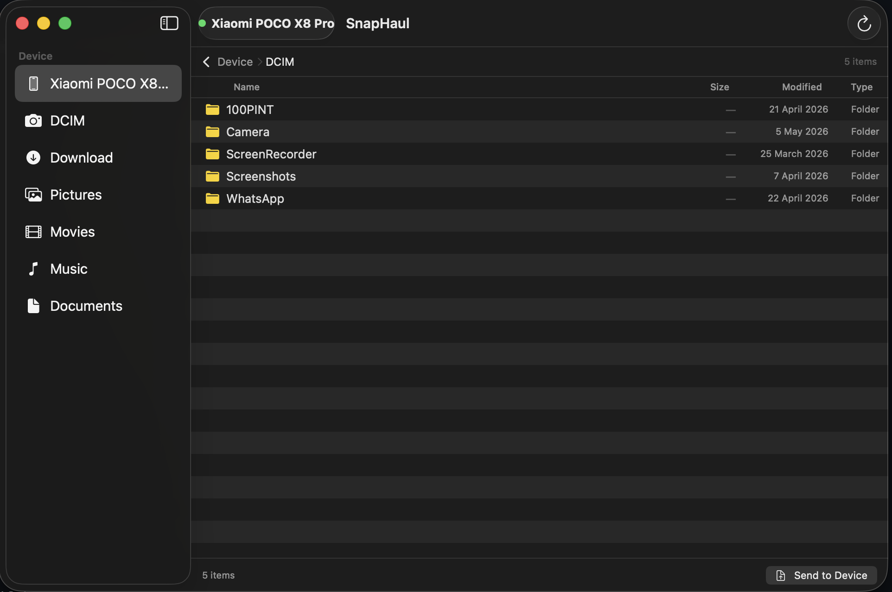

# SnapHaul

> One cable. One click. Every file.

Professional media ingest and file transfer utility (MTP/ADB/Wi-Fi) for **macOS on Apple Silicon**. Replaces the defunct Google Android File Transfer with a native, reliable tool for photographers, videographers, and anyone who needs to move files between Android and Mac.

No kernel extensions. No connection timeouts. No dropped transfers.

---

## What it does

Plug in your Android phone via USB — or connect over Wi-Fi. SnapHaul detects it instantly and gives you three ways to work:

**Full app window** — a proper file manager with sidebar navigation, thumbnail previews, table view, multi-select, drag-and-drop, and bidirectional copy (Android → Mac, Mac → Android).

**Menu bar** — quick access to device status, one-click ingest profiles, and transfer progress without opening a window.

**Automated ingest** — set up a profile once (source folders, file type filter, destination, naming template). Next time you plug in, it runs automatically — only new files, checksummed, renamed, organized into date folders, copied to backup drives, and reported in PDF.

---

## Screenshots


---

## Features

### Transfer engines
- **MTP engine** — built on libmtp. Read, write, delete, rename files on any Android device in File Transfer mode. No USB Debugging required.
- **ADB engine** — uses `adb pull`/`adb push` for faster batch transfers. Requires USB Debugging enabled on the device.
- **Wi-Fi transfer** — ADB over TCP/IP for cable-free ingest when Mac and Android are on the same network. Android 11+ wireless debugging pairing supported.
- **Automatic engine selection** — picks the best engine based on device state and user preference. Falls back gracefully.

### File management
- Browse any folder on the device
- **Thumbnail previews** — real image thumbnails via MTP `GetThumbnail` and ADB MediaStore, not generic icons
- Table view with columns: name, size, date, type
- Multi-select files and folders
- **Drag-and-drop** — drag files from the device to Finder, Lightroom, or any app. Drag files from Finder onto the device.
- Copy files: Android → Mac or Mac → Android
- Delete and rename files on the device
- Double-click folders to navigate, breadcrumb path bar, back button
- Sidebar with quick-access folders (DCIM, Download, Pictures, Movies, Music, Documents)
- Spacebar Quick Look preview for the selected file

### Automated ingest
- **Ingest profiles** — define source directories, file type filters, destination, naming template, subfolder structure
- **Delta-sync** — only transfers new or modified files (manifest stored in SQLite)
- **EXIF-aware naming** — rename files using camera model, date, sequence number
- **Sidecar file pairing** — automatically pairs RAW+XMP, ARW+JPG, CR3+THM files so they stay together through renaming
- **File type presets** — Professional Media (RAW + video), All Images, All Video, All Audio, Documents, All Files, or custom
- **Smart queue ordering** — transfer largest files first, newest first, or any other priority. Configurable per profile.
- **Auto-trigger** — start ingest automatically when a known device connects
- **Checksum verification** — XXH3 (fast) or SHA-256 (forensic) post-transfer integrity check
- **Multi-destination copy** — simultaneously copy to your working SSD and one or more backup drives. Per-destination verification.
- **Post-ingest hooks** — run shell scripts after ingest completes. Environment variables and JSON report on stdin for Lightroom import, DaVinci Resolve project creation, NAS rsync, Slack notifications.

### Transfer reports
- **PDF reports** — branded summary with per-file checksums, timestamps, error details. Ready for client handoff or chain-of-custody.
- **CSV export** — one row per file for spreadsheet analysis or database import.
- **JSON export** — structured report for programmatic consumption by post-ingest hooks and external tools.
- Auto-generated after each ingest session. Also exportable on demand from Transfer History.

### SD card and camera card support (planned)
- Ingest from SD cards, CF Express cards, and any mounted Finder volume — not just Android devices
- Auto-detection for Canon, Sony, Nikon, Fuji, Blackmagic, GoPro, and DJI card structures
- Same ingest pipeline: filter → delta-sync → verify → organize → report
- One tool and one set of profiles for both your phone and your camera

### 90+ file types supported
RAW camera formats (DNG, ARW, CR3, CR2, NEF, RAF, RW2, ORF, and more), video (MP4, MOV, MKV, AVI, ProRes, RED R3D, Blackmagic BRAW), audio (MP3, FLAC, WAV, AAC, OGG), images (JPEG, PNG, HEIC, WebP, AVIF), documents (PDF, Office, iWork), archives, Android APKs, 3D formats, and everything else as generic binary.

### macOS integration
- Menu bar app with device status, transfer progress, and quick actions
- Full app window with sidebar file manager
- macOS notifications for device connect/disconnect, ingest start/complete/error
- Security-Scoped Bookmarks for persistent destination access
- Hardened Runtime and notarization-ready

### Finder integration (File Provider)

With a **paid Apple Developer account** ($99/year), SnapHaul can mount your Android device as a native volume in the Finder sidebar — just like iCloud Drive or Dropbox. You can then drag files in and out of the device directly in Finder, use Quick Look, open files in any app, and use standard Finder operations.

This requires the `com.apple.developer.fileprovider.testing-mode` entitlement, which Apple only provisions for paid Developer ID accounts.

**To enable it:**
1. Sign up for the [Apple Developer Program](https://developer.apple.com/programs/) ($99/year)
2. Open `Sources/FileProviderExtension/SnapHaulFileProvider.entitlements`
3. Add the key:
   ```xml
   <key>com.apple.developer.fileprovider.testing-mode</key>
   <true/>
   ```
4. Rebuild with `xcodegen generate && open SnapHaul.xcodeproj`
5. Sign all targets with your paid Developer ID team

Without a paid account, everything else works — the full app window, menu bar, ingest, bidirectional copy — just not the Finder sidebar volume.

### Performance
- Concurrent ADB transfers (up to 4 parallel streams, reduced to 2 on battery)
- **Power-aware mode** — automatically detects battery vs. AC power. On battery: fewer streams, deferred checksums, E-core only, suppressed Spotlight indexing.
- **Adaptive chunk sizing** — dynamically adjusts read/write chunks based on file size and measured USB throughput. USB 2.0 auto-detected.
- `F_NOCACHE` to avoid polluting the buffer cache during large transfers
- Memory-mapped checksumming (zero-copy via `mmap`)
- SQLite with WAL mode and memory-mapped I/O for manifest database
- Transfer retry with exponential backoff (3 attempts per file)

---

## Requirements

| Requirement | Minimum | Recommended |
|:------------|:--------|:------------|
| macOS | 14 Sonoma | 26 Tahoe |
| Chip | Apple M1 | Apple M4 |
| USB | USB-C port | USB 3.2 cable |
| Wi-Fi | — | Wi-Fi 6 (for wireless transfer) |
| Android | 10+ with MTP | 14+ with USB Debugging |

---

## Installation

### From source (development)

```bash
# Install dependencies
brew install libmtp libusb xcodegen

# Clone
git clone https://github.com/user/snaphaul.git

# Build and run via SPM (no Xcode project needed)
swift build
.build/debug/SnapHaul

# Or generate the Xcode project for full app + extensions
xcodegen generate
open SnapHaul.xcodeproj
```

### Build .app and .dmg

```bash
# Generate the Xcode project
xcodegen generate

# Build the app
xcodebuild -project SnapHaul.xcodeproj \
  -scheme SnapHaul \
  -configuration Debug \
  build \
  -destination 'platform=macOS' \
  SYMROOT="$(pwd)/build" \
  -allowProvisioningUpdates

# The .app is at:
# build/Debug/SnapHaul.app

# Create a DMG
mkdir -p dist
cp -R build/Debug/SnapHaul.app dist/SnapHaul.app
hdiutil create -volname "SnapHaul" \
  -srcfolder dist/SnapHaul.app \
  -ov -format UDZO \
  dist/SnapHaul.dmg

# Output:
# dist/SnapHaul.app  — drag to /Applications
# dist/SnapHaul.dmg  — share with others
```

### Debug CLI tools

```bash
swift build

# Test USB device detection (plug in your phone, watch for events)
.build/debug/SnapHaul --test-usb

# Test MTP connectivity and file listing
.build/debug/SnapHaul --test-mtp

# Test ADB connectivity and file transfer
.build/debug/SnapHaul --test-adb
```

---

## How it works

### Transfer pipeline

```
[Discovery] → [Filter] → [Delta-Sync] → [Transfer] → [Verify] → [Organize] → [Report]

1. Discovery:  Enumerate source dirs via MTP, `adb shell ls`, or FileManager (SD cards)
2. Filter:     Apply file type filters (preset or custom extensions)
3. Delta-sync: Compare against SQLite manifest — skip already-transferred files
4. Transfer:   Pull files via MTP GetObject / `adb pull` / FileManager.copyItem with retry
5. Verify:     Checksum comparison (XXH3 or SHA-256)
6. Organize:   Apply naming template + subfolder structure, pair sidecars, move to destination(s)
7. Report:     Generate PDF/CSV/JSON report — files, bytes, duration, checksums, errors
```

### Architecture

```
┌─────────────────────────────────────────────────────────┐
│                    SwiftUI / AppKit                       │
│  MainWindowView · MenuBarView · PreferencesView          │
├─────────────────────────────────────────────────────────┤
│                    AppState (MainActor)                   │
│  DeviceMonitor · EngineSelector · TransferCoordinator    │
│  IngestEngine · NotificationManager · XPCService         │
├─────────────────────────────────────────────────────────┤
│              TransferEngine protocol                     │
│    MTPEngine (libmtp) · ADBEngine (adb) · VolumeEngine  │
├─────────────────────────────────────────────────────────┤
│  IOKit (USB)  ·  GRDB (SQLite)  ·  ImageIO (EXIF)      │
│  xxHash  ·  CryptoKit (SHA-256)  ·  FileProvider        │
│  PDFKit (reports)  ·  NSWorkspace (volume detection)     │
└─────────────────────────────────────────────────────────┘
```

---

## Supported Android devices

| Tier | Devices | Support |
|:-----|:--------|:--------|
| Tier 1 | Samsung Galaxy S24/S25, Google Pixel 8/9, Sony Xperia 1 V/VI | Full MTP + ADB + Wi-Fi |
| Tier 2 | OnePlus, Xiaomi, Nothing, Motorola | MTP + ADB expected |
| Tier 3 | Any Android 10+ with MTP | MTP should work |

OEM-specific quirks (Samsung large file sizes, Xiaomi connection drops, OnePlus session timeouts) are handled automatically via `DeviceQuirks`.

### Camera cards (planned)

| Brand | Card Types | Detection |
|:------|:-----------|:----------|
| Canon | SD, CF Express | `DCIM/100CANON/`, `DCIM/100EOS*/` |
| Sony | SD, CF Express Type A | `DCIM/100MSDCF/`, `PRIVATE/M4ROOT/` |
| Nikon | SD, CF Express, XQD | `DCIM/100NIKON/`, `DCIM/100NCD*/` |
| Fujifilm | SD | `DCIM/100_FUJI/` |
| Blackmagic | SD, CF Express | `.braw` files in DCIM |
| GoPro | microSD | `DCIM/100GOPRO/` |
| DJI | microSD | `DCIM/DJI_*/`, `DCIM/100MEDIA/` |

---

## Roadmap

### v1.0 — Core (current)
- MTP + ADB engines, File Provider, ingest pipeline, delta-sync, checksum verification, EXIF naming, menu bar + file browser UI, drag-and-drop

### v1.1 — Workflow Enhancements
- Wi-Fi transfer (ADB over TCP/IP)
- Thumbnail previews in file browser
- Multi-destination copy
- Transfer reports (PDF/CSV/JSON)
- Post-ingest hooks (shell scripts)
- Sidecar file pairing (RAW+XMP, ARW+JPG)
- Ingest profile export/import (JSON)
- Localization (Japanese, Korean, German, Spanish, Portuguese)

### v1.2 — Performance & Multi-Device
- Smart queue ordering (largest first, newest first, etc.)
- Power-aware transfer mode (battery optimization)
- Adaptive chunk sizing (throughput calibration)
- Multi-device simultaneous ingest
- NAS destinations (SMB/NFS)
- Transfer scheduling

### v2.0 — Platform Expansion
- SD card and camera card ingest (Canon, Sony, Nikon, Fuji, Blackmagic, GoPro, DJI)
- CLI tool (`snaphaul ingest --profile "Photo Shoot"`)
- FSKit migration (when mature)

---

## License

**GNU General Public License v3.0 (GPLv3)**

SnapHaul is free software. You can use, modify, and distribute it — for any purpose, including commercial — under the terms of the GPLv3. The key requirement: if you distribute modified versions, you must also release your source code under GPLv3. No one can take this code, close it up, and charge for it.

See [LICENSE](LICENSE) for the full text.

---

## Contributing

Contributions welcome. See [CONTRIBUTING.md](CONTRIBUTING.md) for guidelines.

```bash
# Run tests before submitting
swift test

# Lint
swiftlint
```
